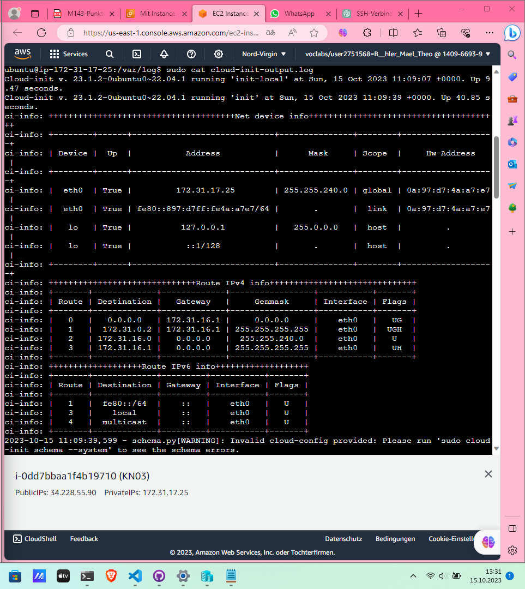

# Modul 346
## KN00
### Cloud-init
Eine Cloud init Datei ist die Generelle bezeichnung für ein File das für die Konfiguration und steuerung einer Cloud umgebung Verantwortlich ist. In dieser Cloud init Datei sind anweisungen enthalten die beim start einer VM oder des Containers zum Beispiel ausgeführt werden. kSo ein Cloud init File kann auch in verschiedenen Dateitypen sein zum Beispiel YAML JSON oder Bash. In diesem File sind Netzwerkkonfigurationen enthalten, Benutzerrechte, Softwareinstallationen und Konfigurationen.
#### Eine virtuelle instanz mit Cloud Init installieren
1. Erstellen einer VM in einer Cloud Umgebung
2. Danach sollte man die Konfigurations und Meta Dateien angeben die wärend dem erstellen dann verwendet werden.
3. Sobald die VM erstellt ist ruft die cloud init Datei die Konfigurationsdatein ab und führt diese Aufgaben aus.
#### Was ist Infrastructure as Code
IaC ist ein Konzept mit dem man mit hilfe von Code Herausfindet welche Infrastruktur anforderung mein System hat. Das bedeutet das die gesamte Infrastruktur mit allem nötigen per code beschrieben und behandelt wird.
##### Welche Produkte bieten Infrastructure As  Code an
1. Terraform
2. AWS CloudFormation
2. Azure Resource Manager Templates
3. Google Cloud Deployment Manager
4. Ansible
5. Viele weitere
### Virtualisierung
Ein Hypervisor ist für die bereitstellung und verwaltung von VMs zuständig.
1. Typ1 wird direkt auf der Hardware installiert.
2. Typ2 wird auf einem bereits vorhanden Betryíebsystem installiert.

Was ist ein hyperscaler
Das ist ein cloud anbieter der eine sehr grosse Infrastruktur hat das heisst grosse skalierbarkeit für den Kunden. 

### Betriebsmodelle
#### On Premise
Die ganze hard und software wird

### Unterschied Public und Private cloud
In der Public Cloud werden Resourcen von einem Anbieter bereitgestellt und dann von mehreren Benutzern benutzt die Sicherheit häng sehr stark von dem Anbieter ab und ist auch in seiner Verantwortung. Bei der Private cloud ist das anders dort hat die Organistation die komlette kontrolle. Jedoch hat man in der Orivat cloud auch höhere kosten für hardware.

## Servicemodelle

#### 1.Infrastructure as a Service
Bei diesem Modell werden grundlegende Komponenten bereitgestellt wie Maschienen Speicher Netzwerke etc. Dort kann man dann seine eigenen Betriebsysteme und anwendungen installieren.
#### Platform as a service
Hier kann man sich voll auf die entwicklung des Services oder der Anwendung. Das heisst Aspekte wie betriebsystem oder Netzwerkinfrastruktur wird vom Anbieter übernomen.
#### Software as Service
Bei diesem Modell muss sich um nichts gekümmert werden es wird netzwerk Hardware infrastruktur einfach alles bereitgestellt und man kann einfach die anwendungen verwenden.
#### Function as a Service
Dies ist eine Option die es einem ermöglicht einzele codeabschnitte auf einer serverlosen einheit laufen zu lassen. Ohne sich um die verwaltung zu kümmern.
### Beispiel Infrastructure as a Service
AWS
### Beispiel Platform as a service
MS Azure
### Beispiel Software as Service
MS Office 365

# AWS
## KN02
### EC2

### S3

### SSH-Key

### Web- und Datenbankserver

## KN03
### Cloud-init Datei Verstehen
#cloud-config
users: #Anfang User Konfiguration
  - name: ubuntu #user ubuntu wird erstellt
    sudo: ALL=(ALL) NOPASSWD:ALL #user ubuntu kann alles mit sudo machen ohne passwort
    groups: users, admin # ubuntu wird der gruppe users und admin hinzugefügt
    home: /home/ubuntu #Das heimverzeichnis des users Ubuntu wird festgelegt
    shell: /bin/bash #standart shell des users ubuntu wird festgelegt
    ssh_authorized_keys: #Konfiguration für zugelassene ssh schlüssel
      - ssh-rsa AAAAB3NzaC1yc2EAAAADAQABAAABAQC0WGP1EZykEtv5YGC9nMiPFW3U3DmZNzKFO5nEu6uozEHh4jLZzPNHSrfFTuQ2GnRDSt+XbOtTLdcj26+iPNiFoFha42aCIzYjt6V8Z+SQ9pzF4jPPzxwXfDdkEWylgoNnZ+4MG1lNFqa8aO7F62tX0Yj5khjC0Bs7Mb2cHLx1XZaxJV6qSaulDuBbLYe8QUZXkMc7wmob3PM0kflfolR3LE7LResIHWa4j4FL6r5cQmFlDU2BDPpKMFMGUfRSFiUtaWBNXFOWHQBC2+uKmuMPYP4vJC9sBgqMvPN/X2KyemqdMvdKXnCfrzadHuSSJYEzD64Cve5Zl9yVvY4AqyBD aws-key       # öffentlicher ssh schlüssel für den user ubuntu
ssh_pwauth: false #passwort wird deaktiviert damit sich der user nur per ssh einloggen kann
disable_root: false #root user wird nicht gelöscht
package_update: true # System wird bei der erstellung geupdated
packages:
  - curl # Befehlszeilentool das zum übertragen von Daten zuständig ist.
  - wget # Befehlszeilentool das zum Herunterladen von daten aus dem Internet zuständig ist.
### SSH-Key und Cloud-init
#### Angepasstes cloud init
#cloud-config
users:
  - name: ubuntu
    sudo: ALL=(ALL) NOPASSWD:ALL
    groups: users, admin
    home: /home/ubuntu
    shell: /bin/bash
    ssh_authorized_keys:
      - ssh-rsa AAAAB3NzaC1yc2EAAAADAQABAAABAQClMuN4c8pSm7QH4RDE2Mx3uEWWihkZ36qAondBO+sGkJtMeX+W5BwTHCSFNqyniqKuMHcKcYhfzcMHMtFB3+k3oIHx2hle7KY9ZAzoefAa/WBQOdpwwwEVMhIGQmqH1IA2xbseQbOYBdu8q4U5fEvHWyrDZyjqYRcmoIH8iOoKCZZ5NfaAPixvdxd4aOYpIsDa/Xujk7vyYl0Wto8SYni91Cb5iygvS95tJyPfTtrNjGuOdVnCRKRRmX4AQefpHmnKJmsT41VLYjJI8OhtLD2KJ6MImJBcPqIsiw8mYMDwJTvKFUrwrR7JM7c2gVNA6Ypv88pBtFMfZpEJ8BhTTM9z aws-key       
ssh_pwauth: false
disable_root: false 
package_update: true
packages:
  - curl 
  - wget 

#### Schlüsselpaar beim Start zugewiesen

#### Zugriff per SSH durch den ersten schlüssel

#### Zugriffsversuch per SSH durch den zweiten Schlüssel

#### Cloud init log

#### cloud-init-output log

#### MariaDB

#### telnet

#### telnet

#### Cloud init
#cloud-config
users:
  - name: ubuntu
    sudo: ALL=(ALL) NOPASSWD:ALL
    groups: users, admin
    home: /home/ubuntu
    shell: /bin/bash
    ssh_authorized_keys:
      - ssh-rsa AAAAB3NzaC1yc2EAAAADAQABAAABAQCJcKHgH4tZN1XjGda61Bwxgq+kqrsblBy/H+n6/h107YRRYRpOi3UeG6u5ibS1+dAZKPr2lF9JWUAn/zqbFDfTUR7p05b+XwJ0LkB+AafL1vM6Spp8NTqU6QqXpXm8309lP3IlD6T5w+sJlmm5ixpOnv711y1zVnUBvA492O/dqG/gt7xNEMMxVzB/5Lw0bxQz1AEWPAIol0WeLQKfN8sSd/jerOVcHKabt9pk3BdqwJWx0YRDDfICPFKw43mcfzFhytGtkH87nMnT61jA4/ZFSzPiFJYueabkBIC9tEzuCm0fJWaXe+vL0oaIurohtwdIb5nU5diQuNYzjeD2PXIH aws-key       
ssh_pwauth: false
disable_root: false 
package_update: true
packages:
  - curl 
  - wget
  - mariadb-server
runcmd:
  - sudo mysql -sfu root -e "GRANT ALL ON *.* TO 'admin'@'%' IDENTIFIED BY 'password' WITH GRANT OPTION;"
  - sudo sed -i 's/127.0.0.1/0.0.0.0/g' /etc/mysql/mariadb.conf.d/50-server.cnf
  - sudo systemctl restart mariadb.service
  #### index.html
  
  #### info.php
  
  #### db.php
  
  #### adminer
   

 ## KN04

  #cloud-config
users:
  - name: ubuntu
    sudo: ALL=(ALL) NOPASSWD:ALL
    groups: users, admin
    home: /home/ubuntu
    shell: /bin/bash
    ssh_authorized_keys:
      - ssh-rsa AAAAB3NzaC1yc2EAAAADAQABAAABAQCJcKHgH4tZN1XjGda61Bwxgq+kqrsblBy/H+n6/h107YRRYRpOi3UeG6u5ibS1+dAZKPr2lF9JWUAn/zqbFDfTUR7p05b+XwJ0LkB+AafL1vM6Spp8NTqU6QqXpXm8309lP3IlD6T5w+sJlmm5ixpOnv711y1zVnUBvA492O/dqG/gt7xNEMMxVzB/5Lw0bxQz1AEWPAIol0WeLQKfN8sSd/jerOVcHKabt9pk3BdqwJWx0YRDDfICPFKw43mcfzFhytGtkH87nMnT61jA4/ZFSzPiFJYueabkBIC9tEzuCm0fJWaXe+vL0oaIurohtwdIb5nU5diQuNYzjeD2PXIH ssh_pwauth: false
disable_root: false
package_update: true  
packages:
  - apache2
  - adminer
  - curl
  - wget
  - php
  - libapache2-mod-php
  - php-mysqli
write_files:
  - content: |
      <?php phpinfo(); ?>
    path: /var/www/html/info.php
    permissions: '0644'
write_files:
- content: |
    <?php
    $ihrname = "Mael";
    ?>
      <html>
      <head>
      <title><?php echo $ihrname; ?></title>
      </head>
      <body>
      <h1>Merjungfrau.</h1>
       
      
      </body>
      </html>
    ?>
  path: /var/www/html/image.php
  permissions: '0644'
runcmd:
  - sudo systemctl restart apache2

Hot Speicher der sofort verfügbar ist
Warm Wird nicht so heufig wie hot verwendet muss trozdem schnell verfügbar sein
Cold wird selten oder nie benötigt zugriffszeit keine priorität

172.31.48.230/20
172.31.48.231/20

